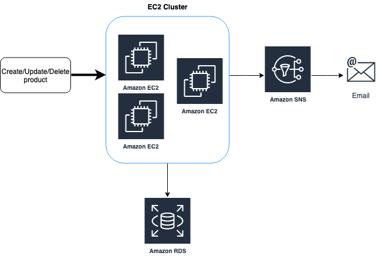

# Como desenvolver aplicações em Java para Amazon Web Services 
Esse repositório de código fonte é relacionado a esse [livro](http://leanpub.com/amazonwebservice), sobre como desenvolver aplicações em **Java**  utilizando **Spring Boot** para serem executadas na **Amazon Web Services**. 

Nesse exemplo será construída uma aplicação com serviços REST para cadastro de produtos de uma loja. Tais produtos serão armazenados em um banco de dados MySQL utilizando o [AWS RDS](https://aws.amazon.com/rds/). Em cada operação de cadastro, exclusão ou alteração de um produto, um evento será publicado em um tópico do [AWS SNS](https://aws.amazon.com/sns), permitindo a integração com outras aplicações. Essa aplicação também fará importação de arquivos de notas fiscais através do [AWS S3](https://aws.amazon.com/s3/).

Veja a seguir um diagrama com os serviços da AWS que são utilizados.

Para aprender esses e outros conceitos sobre desenvolvimento de aplicações utilizando Amazon Web Services, não deixe de conferir esse [livro](http://leanpub.com/amazonwebservice)!